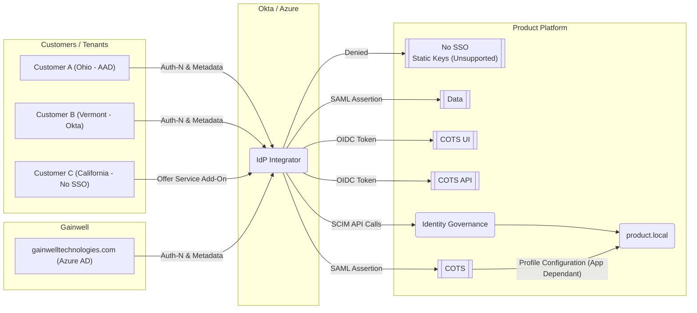

# Identity Provider Integrator

---

## Questions / Considerations

Do we need a middleware service between IdP Integrator and the product?

  1. Perform Profile Creation - Based on the assertions attributes, `roles(s)` and `Id`, do we need to create local profiles / identities within the product or it's apps to support how that app functionality with SSO?
  1. Do we need to kick off any other job?
    - Emails to `Id`
    - Notifications to `Tenant`

Who maintains responsibility for the **IdP Integrator**?

  1. Gainwell Corporate or the product?
    - What does the model look like to onboard a new tenant?
    - Will there be a ticketing system to manage this?
